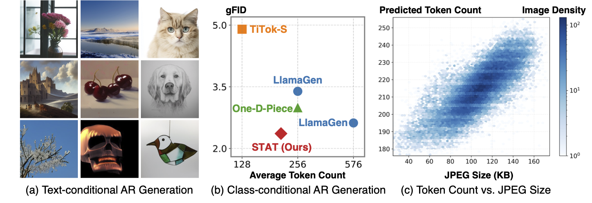

<div align="center">

# STAT: Soft Tail-dropping for Adaptive Visual Tokenization

[Zeyuan Chen](https://zeyuan-chen.com/)<sup>1,2</sup> · [Kai Zhang](https://kai-46.github.io/website/)<sup>2</sup> · [Zhuowen Tu](https://pages.ucsd.edu/~ztu/)<sup>1</sup> · [Yuanjun Xiong](https://yjxiong.me/)<sup>2</sup>

<sup>1</sup>UC San Diego · <sup>2</sup>Adobe

[](https://arxiv.org/abs/2601.14246)
[](https://zeyuan-chen.com/)



</div>

---

## Code Release

> **Note:** We are currently working through Adobe’s open-source review process and will provide updates as they become available. In the meantime, if you are interested in using STAT for research purposes, please feel free to contact Zeyuan Chen at zec016@ucsd.edu.

## Citation

```bibtex
@article{chen2026soft,
  title={Soft Tail-dropping for Adaptive Visual Tokenization},
  author={Chen, Zeyuan and Zhang, Kai and Tu, Zhuowen and Xiong, Yuanjun},
  journal={arXiv preprint arXiv:2601.14246},
  year={2026}
}
```